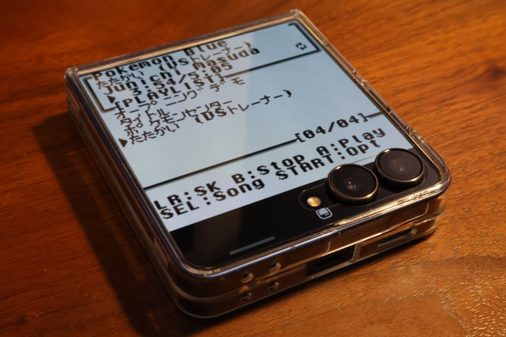

#  GBS Player

[English](README.en.md)

GBS Player は、GBS ファイルを再生するためのプレイヤーツールです。 


<table>
<tr>
<td align=center></td>
<td align=center></td>
</tr>
<tr>
<td align=center>GBS Playerの画面例</td>
<td align=center>Android用 GBS Player<br>(SameBoyコア)</td>
</tr>
</table>

GBSファイルやGB/GBCのROMファイルを読みこんで、BGM等を再生して音楽プレイヤーのように使用することができます。


## ドキュメント

- [操作方法 / オプション画面項目説明](docs/usage.md)
- [AndroidPlayerの機能説明](docs/android-player.md)
- [使用可能な文字一覧](docs/usable-characters.md)
- [曲名/曲長リストの仕様について](docs/songlist-format.md)
- [ビルド関連情報](docs/build.md)


### 動作環境

- GB/GBC/GBA実機
  - フラッシュカート等を使用
- Analogue Pocket
- 各種エミュレータ
- Android Player (SameBoyカスタム版)


## 主な機能と特徴

### GBS Player 本体

- 90年代後半のGB向けRPGを彷彿とさせる操作感を実現
- 曲長設定、プレイリスト設定、リピート、フェード、無音検出、ステレオ/モノラル設定機能を搭載
  - 詳細は[操作方法](docs/usage.md)を参照
- 長い曲名などはスクロール表示
- ひらがな、カタカナ、英数字の曲名表示可能


### GUIツール付属

GUIでの曲名編集・プレイリスト編集・ビルド・AndroidPlayerのビルドとインストールにも対応


### Android Player
Androidアプリとしてビルドし、ビルトインのGBエミュレータ(SameBoy)を介して、端末上で音楽プレイヤーのように使用が可能です


#### Android標準の再生コントロールから操作可能


再生/一時停止、曲送り/戻し、リピート設定が可能です。

#### 複数ROM読み込み機能

「ライブラリ」より、GUIツールにて追加した複数のROMを切り替えて使用できます。
また、GBS Player以外のROMも読み込んで使用可能です。

#### そのほか様々な便利機能を搭載

詳細は [こちら](docs/android-player.md)

---

## ビルド手順

### 必要物の準備

- 各種ROMファイルやGBSファイル
- Windows (またはWindows10以上に準じた環境)
- GBDK-2020
- Python 3
- GNU make
  - Windows では `winget` で入る `ezwinports.make` を推奨

Android Playerをビルドする場合は下記も必要です

- Android Studio
  - Android SDK/NDK
  - CMake
- Android開発者オプションの有効化と端末のペアリング

#### リポジトリのクローン

本リポジトリをクローンして、プロジェクトのルートフォルダに移動してください。

```powershell
git clone https://github.com/kleusbalut/gbs_player
cd gbs_player
```

#### 必須開発環境などのインストール

GBDK-2020、Python 3、GNU make をインストールします。

GBDK-2020を公式サイトからダウンロードして、可能であれば `C:/dev/gbdk` に配置してください。

[GBDK-2020 Releases](https://github.com/gbdk-2020/gbdk-2020/releases/)

Windows 11以上をお使いの方は `gbdk-win64.zip` をダウンロードしてください。

> [!NOTE]
> 以降の説明では、GBDKを `C:/dev/gbdk` に配置したものとして説明します。
> 別の場所に配置した場合は適時書き換えてください。

Python 3を下記のコマンドでインストールしてください。

```powershell
winget install Python.Python.3.14 --source winget
```

続けて、make を下記のコマンドでインストールしてください。

```powershell
winget install ezwinports.make --source winget
```

インストール後、`make` コマンドが見つからない場合は PowerShell を開き直してください。


#### AndroidStudioのセットアップ


Android Player をビルドするには、[Android Studio](https://developer.android.com/studio) をインストールしたうえで Android SDK/NDK/CMake をセットアップします。

> [!NOTE]
> Android Playerが不要な方は [GBSPlayerToolの実行](#GBSPlayerToolの実行) までスキップしてください。

> [!NOTE]
> すでにAndroid開発環境を構築して、端末の設定も完了されている方は [SameBoyの取得](#SameBoyの取得) までスキップしてください。


Windows では PowerShellから下記のコマンドでインストールしてください。

```powershell
winget install Google.AndroidStudio --source winget
```

インストール後、Android Studio を一度起動して初期セットアップを行います。
`Install Type` の画面で `Standard` を指定してセットアップしてください。


> [!NOTE]
> `Custom`を選択したり、セットアップをスキップした場合は、Android Studio を空のプロジェクトで開き、`Tools > SDK Manager`から次を指定してインストールします。
> 
> - Android SDK Platform 34
> - Android SDK Build-Tools
> - NDK (Side by side)
> - CMake 3.22.1

インストールおよびセットアップ完了後、Android Studio で `apps/android` を開き、プロジェクトが正常に読み込めることを確認してください。

#### Android開発者オプションの有効化と端末のペアリング

下記のページを参照して、端末上での開発者オプションの有効化とデバイスへの接続(ペアリング)操作を行ってください。

https://developer.android.com/studio/run/device?hl=ja


#### SameBoyの取得

Android Playerの動作にSameBoy(GBエミュレータ)が必要なため、下記コマンドを入力してインストールしてください。

```powershell
python tools/fetch_sameboy.py
```
> [!TIP]
> ここまでの操作で、コマンドラインからでもビルドできます。<br>
> コマンドラインから APK をビルドする場合は、[こちら](./docs/build.md)を参照ください

#### GBSPlayerToolの実行

初回のみ、Python依存パッケージをインストールします。

```powershell
python -m pip install -r requirements.txt
```

`gbs_player_tool.py` をダブルクリックして実行します。


GBS Player Toolでは、曲名、曲長、プレイリスト、タイトル、作曲者、再生設定などを編集できます。

> [!TIP]
> 曲名などROM上で表示される文字について、
> 英数字と一部の記号、ひらがな、カタカナ以外は入力できません。
> 詳細は [使用可能な文字一覧](docs/usable-characters.md) を確認してください。

各種設定後、インストール先の端末が選択されていることを確認して `すべてビルドしてインストール` を押すと、自動でビルドされインストールが行われます。
複数のソースがある場合はビルドに時間がかかるのでしばらくお待ちください。

`ビルド` を押して、選択されたソースのGBS Playerのみビルドすることもできます。
ビルド後はビルド先フォルダが開くので、ファイルをコピーして使用してください。

> [!NOTE]
> インストール先の端末が見つからない場合は、端末との接続を確認してください。

以上でGBS Playerのビルドは完了です。
ChipTuneをお楽しみください。

問題を発見された場合はissueにてお知らせください。

---

### 出典と謝辞

- GBDK-2020: <https://github.com/gbdk-2020/gbdk-2020>
- SameBoy: <https://github.com/LIJI32/SameBoy>
  - AndroidPlayer組み込みエミュレータとして使用させていただいております
- ポケモンフォント: <https://nue2004.info/program/pkmn/>
  - 日本語表示に使用させていただいております
- BGB emulator: <https://bgb.bircd.org/>
  - デバッグに使用させていただきました

### 参考文献など

- pret disassembly projects: <https://pret.github.io/>
- RGBDS: <https://github.com/gbdev/rgbds>
- GF2MID: <https://github.com/turboboy215/GF2MID>
- gbsplay: <https://github.com/mmitch/gbsplay>
  - 本プロジェクトのネタ元です

---

### 開発のきっかけと開発後記

もともとは [gbsplay](https://github.com/mmitch/gbsplay) を使用して個人で楽しんでいたのですが、下記のニーズがあったため、コード生成AIを使用して開発するに至りました。

- プレイリスト機能
- 自動曲送り機能
- フェードアウト機能
- 曲名表示・日本語対応

また、開発の過程でAndroidエミュレータでのバックグラウンド再生に問題があることが判明したため、いっそのこと通常のメディアプレイヤーのように再生できる機能を搭載して、なおかつGalaxy Z Flip7のサブディスプレイでも動かせるようにしようと思い、SameBoyをベースとしたカスタムGBエミュレータもビルドできるようにしました。



結果的に、AndroidPlayerでは通常のメディアプレイヤーのような操作感を実現でき、利便性を上げることができたと思っています。

そして、AndroidPlayerを作成してメディアプレイヤーとして使用していくうちに、2000年代に流行ったMP3プレイヤーのようにWindows母機からプレイリストなどを編集できると便利だと思い、GUIのGBS Player Toolも作成して、一連のツール群ができあがりました。

---

### おやくそく

本ツールで生成した ROM や、第三者の著作物を含むデータをインターネット等で配布しないでください。

また、`MIT License` はプロジェクト固有コードだけに適用し、本プログラムを用いて出力された生成物には適用されません。
